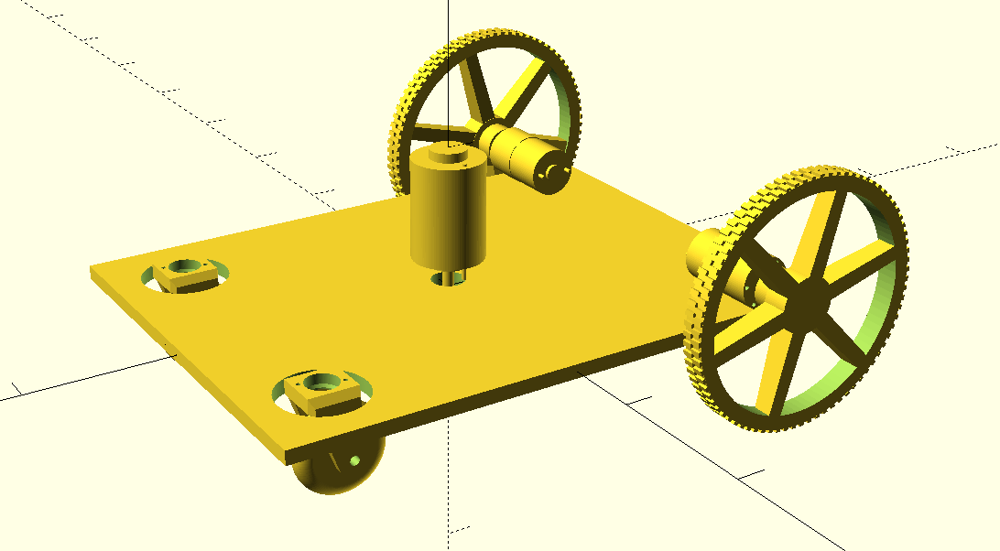
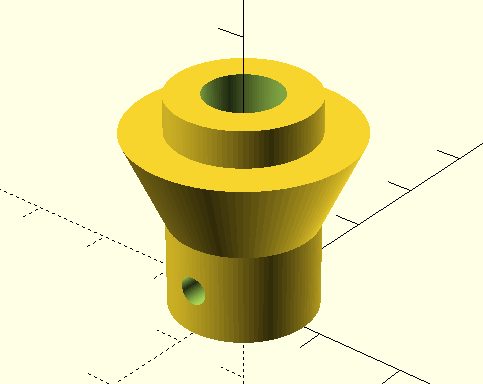
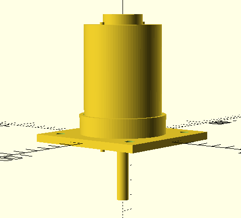
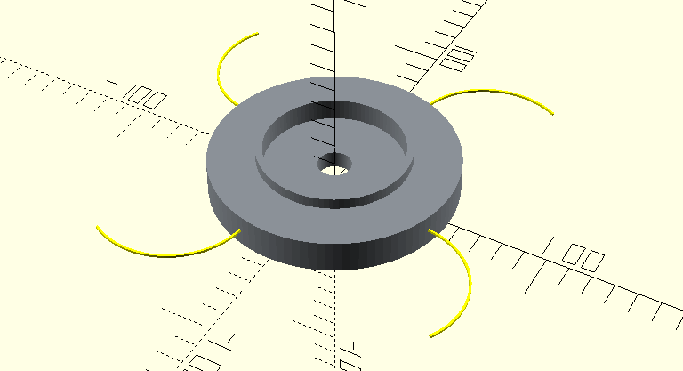
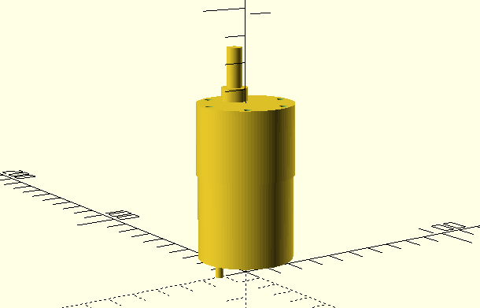
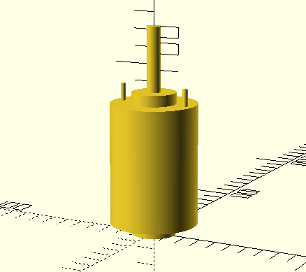
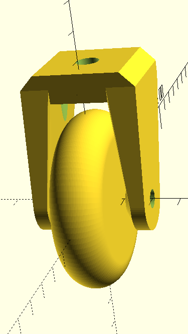
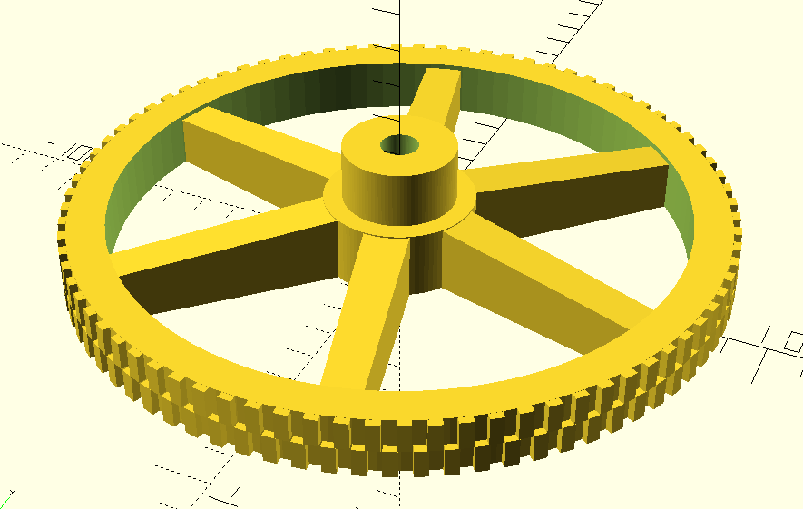

= 3D modeling

== Full 3D view

== 3D parts

.Parts
[width="80%",options="header"]
|=========================================================
| Item | Image

| Motor cut adapter
| 

| Motor cut support
| 

| Motor cut disc
| 

| Motor Gear 30RPM
| 

| Motor Gear support
| image:3d-parts/motor-gear-support.png[Motor gear support, link="3d-parts/motor-gear-support.scad"]

| Motor Gear adapter
| image:3d-parts/motor-gear-adapter.png[Motor gear adapter, link="3d-parts/motor-gear-adapter.scad"]

| Motor XD-3420
| 

| Wheel swiveling
| 

| Wheel gear
| 

|=========================================================

== References

Keyword: "ball caster", "swiveling wheel"

* link:https://www.thingiverse.com/thing:16627/files[tooth]

* link:https://www.thingiverse.com/thing:21486[wheel]

* link:https://www.thingiverse.com/thing:24071[]

* link:https://www.thingiverse.com/thing:617055[Sonar servo-mount]