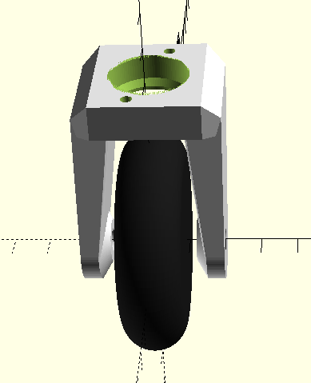

= 3D modeling

Here are the parts used for prototyping.

Some parts are just for modeling view, and some are printed.

The approach is pragmatic: if easier and cheaper to buy, then buy! 
For example, the wheel and base support are bought for very few money.

== Full 3D view

== 3D parts

.Parts
[width="80%",options="header"]
|=========================================================
| Item | Printed | Image

| link:3d-parts/mowing-system-motor-xd-3420.scad[Motor XD-3420]
| No
| 

| link:3d-parts/gear-motor-30rpm.scad[Gear Motor 30RPM]
| No
| 

| link:3d-parts/wheel-360.scad[Wheel swiveling]
| Partially (wheels is roller part)
| 

| link:[Wheel gear]
| No (from the local store)
| 

| link:3d-parts/mowing-system-disc-nylon.scad[Mowing System Disc]
| No
| image:3d-parts/mowing-system-disc-nylon.png[Mowing System Disc, link="3d-parts/mowing-system-disc-nylon.scad"]

| link:3d-parts/gear-parts.scad[Gear parts]
(bearing to support module, shaft coupling, motor support, wheel axle adaptor)
| Yes (motor, axle and wheel appart)
| 

| link:[Mowing System parts]
(support, axle to disc adaptor)

| Yes (Motor appart)
| 

|=========================================================

== References

Keyword: "ball caster", "swiveling wheel"

* link:https://www.thingiverse.com/thing:16627/files[tooth]

* link:https://www.thingiverse.com/thing:21486[wheel]

* link:https://www.thingiverse.com/thing:24071[]

* link:https://www.thingiverse.com/thing:617055[Sonar servo-mount]