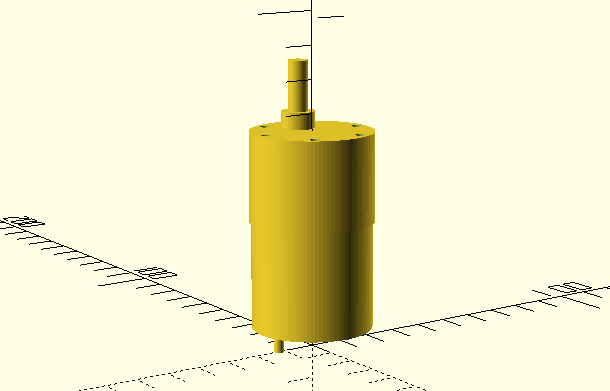
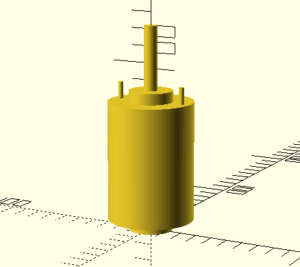

= 3d parts

image:motor-cut-adapter.png[Motor cut adapter, link="motor-cut-adapter.scad"]

image:motor-gear-support.png[Motor gear support, link="motor-gear-support.scad"]

image:wheel-360.png[wheel 360, link="wheel-360.scad"]

image:wheel-gear.png[wheel gear, link="wheel-gear.scad"]

== References

Keyword: "ball caster", "swiveling wheel"

* link:https://www.thingiverse.com/thing:16627/files[tooth]

* link:https://www.thingiverse.com/thing:21486[wheel]

* link:https://www.thingiverse.com/thing:24071[]

* link:https://www.thingiverse.com/thing:617055[Sonar servo-mount]