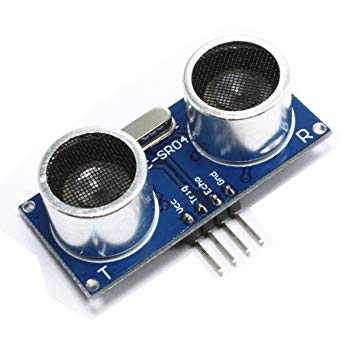

= sonar sensor test

This is easy and straightforward!

The result is interestingly precise enough values when below 3 meters.

== BOM

== Wiring

.Table Hardware Connections
|===
|Arduino |HC-SR04  

|5V    |   VCC
|7     |   Trig
|8     |   Echo     
|GND   |   GND
|===

== Code

Follow example at link:https://github.com/sparkfun/HC-SR04_UltrasonicSensor[GitHub HC-SR04 UltrasonicSensor]

Example is copied at link:/stories/01-sensors-sonar-test/HC-SR04_UltrasonicSensorExample[HC-SR04_UltrasonicSensorExample]