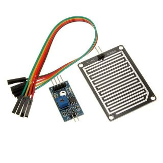

= Sensors - Rain test

== BOM

Rain Drop Sensor

== Wiring

.Table Hardware Connections
|===
|Arduino |Rain Board

|5V    |   VCC
|D12   |   D0
|A0    |   A0 
|GND   |   GND
|===

== Code

link:rain-drop-test[Example]
