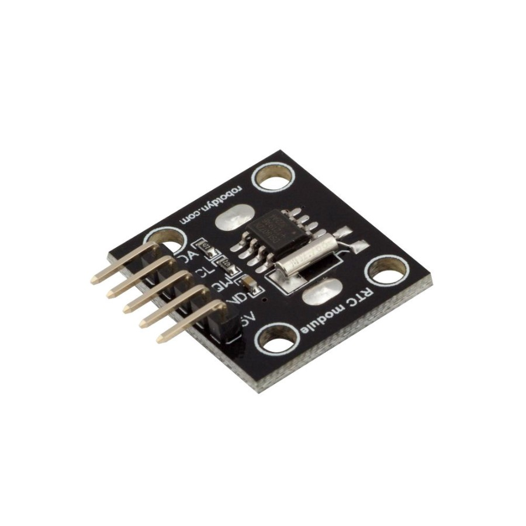

= Relay

== BOM

Arduino RTC Clock

== Wiring

.Table Hardware Connections
|===
|Arduino |Relay Board

|5V    |   VCC
|GND   |   GND
|A5/SCL|   SCL
|A4/SDA|   SDA
|===

== Code

link:relay-test[Example]

== References

* link:https://create.arduino.cc/projecthub/electropeak/interfacing-ds1307-rtc-module-with-arduino-make-a-reminder-08cb61[interfacing-ds1307-rtc-module-with-arduino-make-a-reminder-08cb61]

* link:http://www.theorycircuit.com/rtc-ds-1307-arduino/[rtc-ds-1307-arduino]