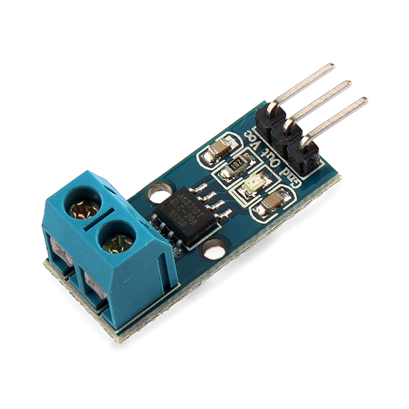

= Sensors - Current Tests

== BOM

ACS712ELC Current Sensor

== Wiring

.Table Hardware Connections
|===
|Arduino |ACS712ELC

|5V    |   VCC
|GND   |   GND
|A0    |   Out
|===

== Code

IMPORTANT: Scale Factors: 185 mV per Amp for 5A module, 100 mV per Amp for 20A, 66 mV per Amp for 30A

link:ACS712-test[Example]

== References

