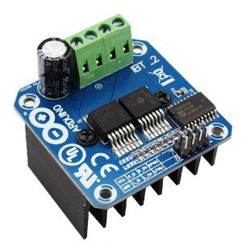
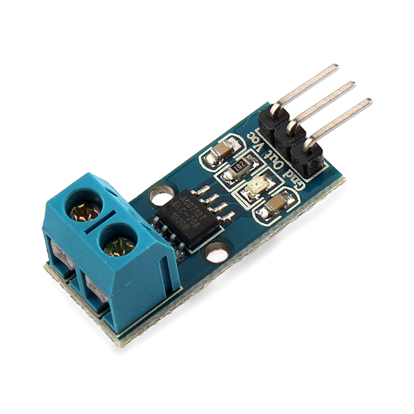

= Motors with Current Measures Tests

The idea of current sensor here is that if the motor starts to have difficulties to rotate, it will start to consume a lot of Amps.

Normal rotation should not consume a lot of power.

Holding a little the rotor should easily increase the power consumption.

== BOM

== Wiring

Wire both motor and current driver as per respective stories link:/stories/02-motors-XD-3420-test[XD-3420] and link:/stories/06-sensors-current-test[Current Test]

== Code

link:/stories/07-motors-current-test/XD-3420-ACS712-test[Example]

