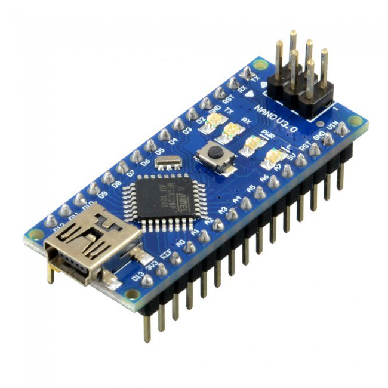
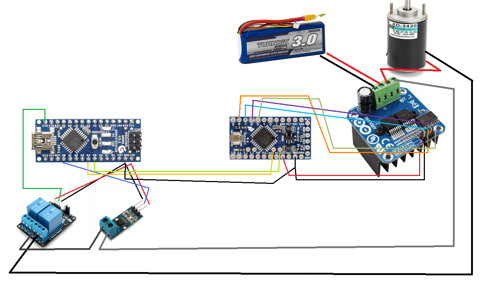

= I2C Tests

Let's decouple motor and current sensor for an example.

* Slave arduino is in charge of motor rotation, with assigned commands through I2C.

* Master arduino assigns commands to slave, and also measures Amps of that slave motor.

* If master measures Amps > 1A, motor is stopped both by command to rotate to 0 and using relay to cut motor current.

== BOM

Using 2 Arduino 5v (Nano or pro mini):

== Wiring

Wire slave arduino as per link:/stories/02-motors-XD-3420-test[Motor story]

Wire master arduino as per link:/stories/06-sensors-current-test[Current measure story]

Wire ACS712 between onto 12v motor: GND to ACS712 first pin, and the 2nd pin to motor controller.

Then wire master and slave as follows:

.Table Hardware Connections
|===
|Arduino #1 |Arduino #1

|GND   |   GND
|(optional) VCC   |   VCC
|A4/SDA|   A4/SDA
|A5/SCL|   A5/SCL
|===

== Code

* link:/stories/08-I2C-test/I2C-master-test[Example master]

* link:/stories/08-I2C-test/I2C-slave-test[Example slave]

== Tesing

Once sketch uploaded, connect to master arduino tty console.

Master:

* outputs commands sent to slave.

* measure current

* command goes to max speed, then stay high speed for 10s, then go slowly to stop

* if slowing down the rotation (fingers!), then master might measure current > 1A.
When this happens, motor will stop right away!!!