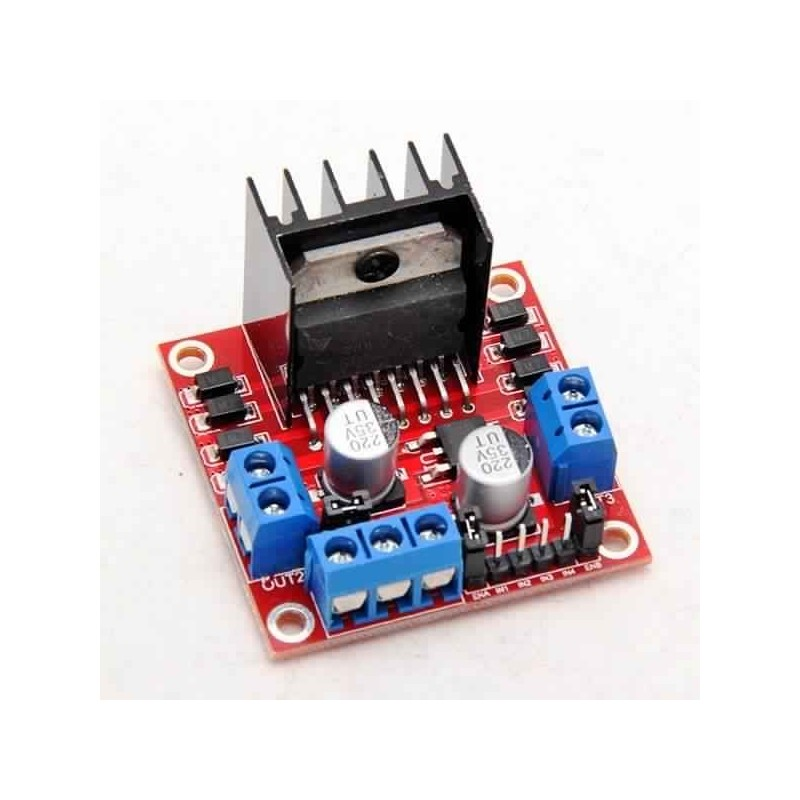
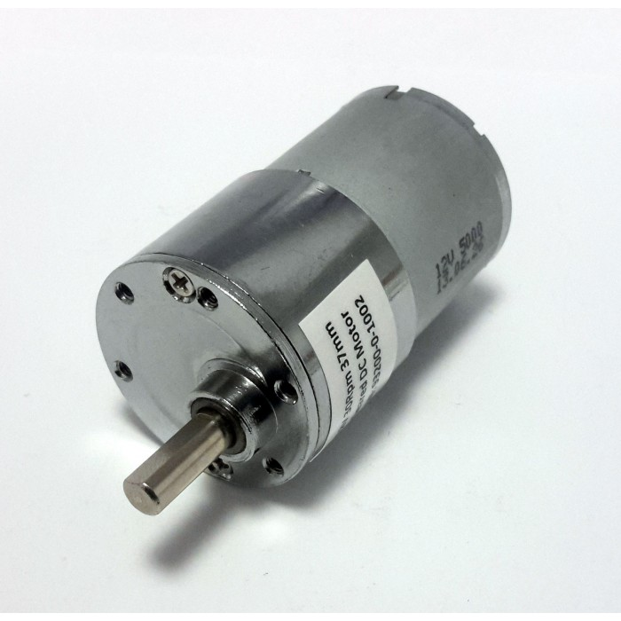
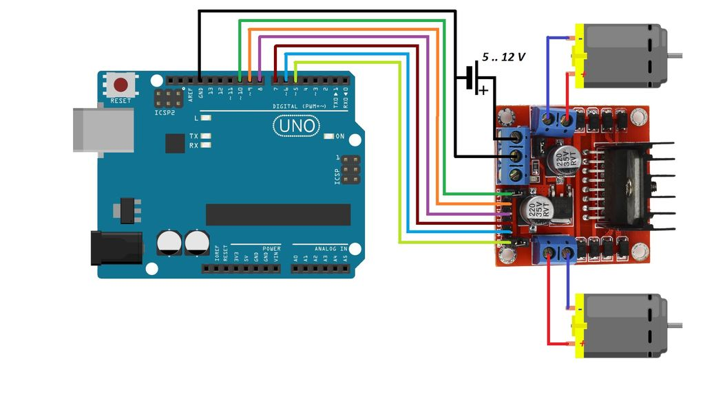

= Motors driver test

Motor driver is L298N.

This test will hook the motors and alternate rotation Clockwise, CounterClockwise.

== BOM

== Wiring

== Code

link:/stories/09-L298N-Test/L298N-test/L298N-test.ino[Example]

== References

link:https://howtomechatronics.com/tutorials/arduino/arduino-dc-motor-control-tutorial-l298n-pwm-h-bridge/[Example L298N]