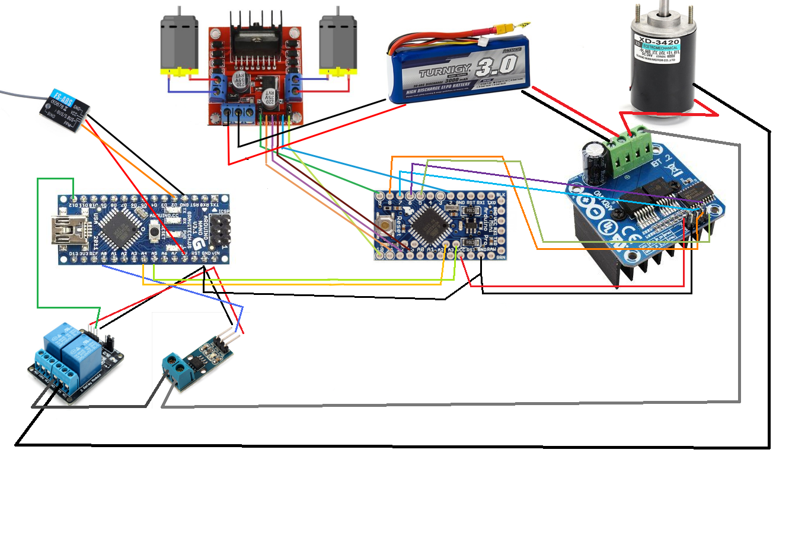

= Motors gear + I2C + motor cut + RF Controller 

Here is sketch with mixing link:/stories/10-L298N-FlySky-test[previous radio story] with link:/stories/08-I2C-test[arduino master and slave through I2C]

Difference is that now we control both motors using FlySky remote.

.Table Arduino usage
|===
|Arduino |Usage

|#1 (master)  |   
Radio Control receiver; 

I2C master; 

Current sensor; 

Relay handler
|#2 (slave)   |   
I2C receiver; 

Gear and Cuting motors handler
|===

== Wiring

* motors and L298N are wired like in link:/stories/09-L298N-Test[previous story]

* motor XD-3420 and drive as in link:/stories/02-motors-XD-3420-test[Wiring XD-3420]

* link:https://github.com/kalemena/drone-car#remote-controlling-flysky[FlySky library and wiring]

== Code

* link:/stories/11-RC-mower-test/RC-mower-master/RC-mower-master.ino[Master Arduino Nano]

* link:/stories/11-RC-mower-test/RC-mower-slave/RC-mower-slave.ino[Slave Arduino pro mini]

